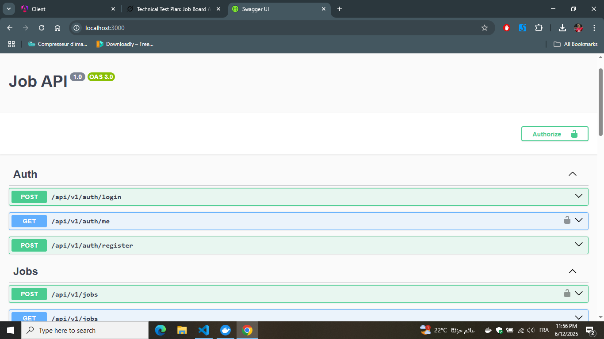

# Job Board Application

A full-stack job board built with **NestJS** (backend) and **Angular** (frontend), containerized with **Docker**. Features include JWT-based authentication, job CRUD, application management, and admin dashboard with statistics.

## Setup & Docker Instructions

1. **Clone the Repository**:
   ```bash
   git clone https://github.com/naceurmossaab/job-listing.git
   cd job-listing
   ```

2. **Environment Variables**:
   - Copy `.env.example` to `.env`:
     ```bash
     cp .env.example .env
     ```
   - Update `.env` with your configuration (e.g., database credentials, JWT secret).

3. **Run with Docker**:
   - Ensure Docker and Docker Compose are installed.
   - Start all services (NestJS, Angular, PostgreSQL):
     ```bash
     docker-compose up --build
     ```
   - Access:
     - Backend: `http://localhost:3000/api/v1/`
                `http://localhost:3000` (Swagger UI)
     - Frontend: `http://localhost:4200`

4. **Database Migrations**:
   - Migrations run automatically on backend startup.
   - To generate new migrations (if needed):
     ```bash
     docker-compose exec backend npm run typeorm migration:generate -- -n dist/data-source.js
     docker-compose exec backend npm run typeorm migration:run
     ```

## Screenshot of Swagger UI


*Note*: The Swagger UI is available at `http://localhost:3000` after starting the backend. It documents all endpoints, including authentication, job CRUD, and application management.

## TailwindCSS and NG-ZORRO Setup Confirmation

- **TailwindCSS**:
  - Configured in `tailwind.config.js` with content paths for Angular components.
  - Applied globally via `@tailwind` directives in `styles.css`.
  - Used for responsive styling across components (e.g., forms, tables, modals).

- **NG-ZORRO**:
  - Installed via `ng add ng-zorro-antd`.
  - Modules (`NzFormModule`, `NzTableModule`, `NzModalModule`, etc.) imported in `app.config.ts` for standalone components.
  - Components used: `nz-form`, `nz-table`, `nz-select`, `nz-card`, `nz-modal`, `nz-button`, `nz-empty`, `nz-pagination`.
  - English locale (`en_US`) set via `provideNzI18n` in `app.config.ts`.

## Assumptions & Challenges

### Assumptions
- PostgreSQL is the database, running in a Docker container.
- JWT authentication is required for protected endpoints (e.g., job CRUD, application management).
- Users have roles: Admin, Employer, JobSeeker.
- File uploads (e.g., CVs) are stored on the server with paths returned in API responses.
- Backend enforces unique job applications (`jobSeekerId`, `jobId`).

### Challenges
- **NG-ZORRO Locale**: Defaulted to Chinese; resolved by setting `en_US` in `app.config.ts`.
- **Form Validation**: Implemented dynamic error mapping to avoid repetitive `*ngIf` checks, integrated with NG-ZORRO's `nz-form`.
- **Error Handling**: Configured global HTTP error interceptor for consistent error messages; required careful handling of `err.error?.message`.
- **Docker Setup**: Ensured single-command startup (`docker-compose up`) with health checks; faced issues with migration timing, resolved by auto-running migrations on startup.
- **Responsive Design**: TailwindCSS simplified styling, but required testing across mobile/desktop for NG-ZORRO components.